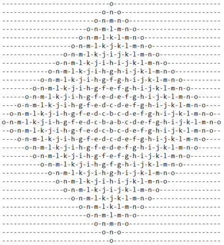

# Alphabet Rangoli

Well, this is a complicated exercise to do because you need to apply so much
logic and also to have a good understanding about strings.

The exercise consists from a number as the input, create a pattern 
(called like the title). There's an example of the pattern:

## Complications

I've not finished this code because I know I can improve it. 
I've felt that when I did the second part of the pattern.
But I don't know if I'll change this part of the description when I 
change the code. If someone is looking this description I want to inform you
there was an ugly code before. And btw I'm glad you are here too, thanks for that!

...

But the complications I had with this code is the understanding and what I
needed to do, because I work with lists and I don't know if it was easier
or if I had been complicating everything. By the way, that's the form I found
easier to do this HackerRank's exercise and the easiest I found for other people
to read the code and understand. I consider this last part the most important
when you're going to work in a team or with someone else.